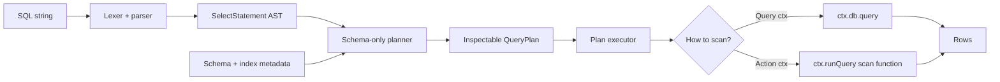
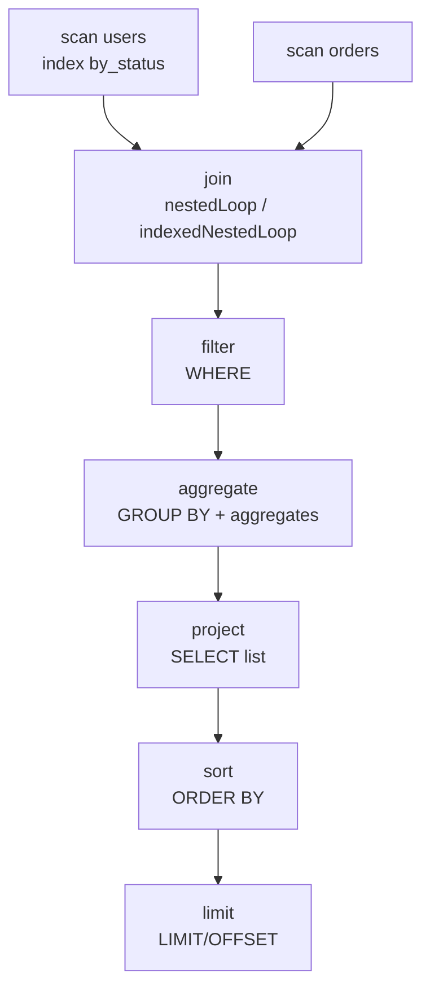

# convex-olap

SQL-style OLAP helpers for Convex apps.

`convex-olap` parses a practical SQL subset, compiles it into an inspectable
query plan using only schema and index metadata, and executes that plan against a
potentially stale Convex database view. It is intended for analytical queries
from Convex actions, reports, exports, backfills, and ad-hoc internal tooling.

```ts
import { SQL } from "convex-olap";
import schema from "./convex/schema";

const convexSQL = new SQL(schema);

const results = await convexSQL(
  ctx,
  "SELECT COUNT(*) AS count FROM users WHERE email LIKE '%@gmail.com'",
);
```

## Why this exists

Convex queries are transactional and strongly consistent, but large OLAP-style
queries often need to page through many documents or join multiple streams. In
Convex, that orchestration belongs in actions that call queries in loops. This
library gives you a SQL-shaped interface for that pattern while keeping the
compiled plan visible and testable.

The planner deliberately does **not** use table sizes, histograms, or runtime
statistics. It only uses the schema and index metadata you provide.

## Installation

```sh
npm install convex-olap
```

`convex` is a peer dependency and should already be installed in your Convex app.

## Mental model



Execution is intentionally simple:

1. Parse SQL into an AST.
2. Compile the AST into a plan containing scan, filter, join, aggregate,
   project, sort, and limit nodes.
3. Annotate scans with usable equality-prefix indexes from the supplied schema.
4. Collect rows from Convex through a query context or an action scan query.
5. Evaluate the remaining relational operators in memory.

## Pass your Convex schema

The main constructor expects the same schema object you export from
`convex/schema.ts`.

```ts
// convex/schema.ts
import { defineSchema, defineTable } from "convex/server";
import { v } from "convex/values";

export default defineSchema({
  users: defineTable({
    email: v.string(),
    status: v.string(),
    age: v.number(),
  })
    .index("by_status", ["status"])
    .index("by_status_email", ["status", "email"]),
  orders: defineTable({
    userEmail: v.string(),
    total: v.number(),
  }).index("by_userEmail", ["userEmail"]),
});
```

```ts
import { SQL } from "convex-olap";
import schema from "./schema";

const convexSQL = new SQL(schema);
```

`convex-olap` reads table names, validators, and indexes from Convex's
`defineSchema` / `defineTable` objects. Index fields are ordered. For
`["status", "email"]`, the planner can use:

- `status = 'active'`
- `status = 'active' AND email = 'a@example.com'`

It cannot use `email = 'a@example.com'` alone for that index because that skips
the index prefix.

For unit tests or standalone scripts, you can also pass a lightweight structural
schema object with `{ tables: { ... } }`, but Convex apps should pass the actual
schema export.

## Usage examples

### 1. Run a SQL query from a Convex query

Convex query functions have `ctx.db`, so `convex-olap` can scan directly.

```ts
// convex/reports.ts
import { v } from "convex/values";
import { query } from "./_generated/server";
import { SQL } from "convex-olap";
import schema from "./schema";

const convexSQL = new SQL(schema);

export const gmailUsers = query({
  args: {},
  handler: async (ctx) => {
    return convexSQL(
      ctx,
      `
        SELECT COUNT(*) AS count
        FROM users
        WHERE email LIKE '%@gmail.com'
      `,
    );
  },
});
```

### 2. Run SQL from a Convex action

Convex actions do not expose `ctx.db`, so action execution needs a scan query.
Register one query in your app with `scanQuery()`.

```ts
// convex/olap.ts
import { scanQuery } from "convex-olap";

export const scan = scanQuery();
```

Then pass that query reference to `SQL`.

```ts
// convex/reports.ts
import { action } from "./_generated/server";
import { api } from "./_generated/api";
import { SQL } from "convex-olap";
import schema from "./schema";

const convexSQL = new SQL(schema, {
  scanQuery: api.olap.scan,
  pageSize: 256,
});

export const statusReport = action({
  args: {},
  handler: async (ctx) => {
    return convexSQL(
      ctx,
      `
        SELECT status, COUNT(*) AS count
        FROM users
        GROUP BY status
        ORDER BY count DESC
      `,
    );
  },
});
```

### 3. Join tables and aggregate

```ts
const rows = await convexSQL(
  ctx,
  `
    SELECT u.email AS email, SUM(o.total) AS revenue
    FROM users u
    JOIN orders o ON u.email = o.userEmail
    GROUP BY u.email
    HAVING SUM(o.total) > 100
    ORDER BY revenue DESC
    LIMIT 20
  `,
);
```

### 4. Inspect a plan before running it

```ts
const plan = convexSQL.plan(`
  SELECT email
  FROM users
  WHERE status = 'active' AND email = 'a@gmail.com'
`);

console.dir(plan, { depth: null });
console.log(plan.tables[0]?.index);
```

Example scan metadata:

```json
{
  "tableName": "users",
  "alias": "users",
  "index": {
    "name": "by_status_email",
    "fields": ["status", "email"],
    "equalities": {
      "status": "active",
      "email": "a@gmail.com"
    }
  }
}
```

## How the planner works

Plans are pipelines of typed plan nodes.



A `QueryPlan` contains:

- `ast`: the parsed `SelectStatement`
- `root`: the executable plan tree
- `tables`: every planned table scan with alias and chosen index metadata
- `aggregates`: aggregate expressions discovered in projections, `HAVING`, and
  `ORDER BY`
- `executionMode`:
  - `singleQuery`: simple single-table plans
  - `actionLoop`: plans expected to page through data from an action
  - `inMemory`: more complex plans evaluated by the in-memory executor
- `warnings`: non-fatal planner warnings, such as missing schema metadata

The current executor evaluates joins, grouping, sorting, and projection in
memory after collecting pages. The `executionMode` is an annotation for callers
and tests; it does not currently switch to a different physical executor.

## Visualizing and debugging query plans

### Print the parsed AST

```ts
const ast = convexSQL.parse(sql);
console.dir(ast, { depth: null });
```

Use this when SQL does not parse the way you expect. It shows aliases,
qualified identifiers, function calls, and predicate nesting.

### Print the complete plan

```ts
const plan = convexSQL.plan(sql);
console.dir(plan.root, { depth: null });
console.table(plan.tables);
console.table(plan.aggregates);
console.log(plan.warnings);
```

### Check index selection

```ts
const plan = convexSQL.plan(`
  SELECT *
  FROM users
  WHERE status = 'active' AND email = 'a@gmail.com'
`);

if (!plan.tables[0]?.index) {
  throw new Error("Expected planner to use an index");
}
```

The planner only chooses indexes for literal equality predicates that match an
index prefix. If an expected index is missing, check:

1. The table name and alias in the SQL.
2. The index name and field order in schema metadata.
3. Whether the predicate is equality against a literal.
4. Whether the predicate is connected by `AND`; `OR` predicates do not currently
   produce index ranges.

### Convert a plan tree to Mermaid

The package returns plain JSON plan nodes, so you can visualize them with a small
helper in tests or debug tooling.

```ts
import type { PlanNode } from "convex-olap";

function planToMermaid(root: PlanNode): string {
  const lines = ["flowchart TD"];
  let nextId = 0;

  function visit(node: PlanNode): string {
    const id = `n${nextId++}`;
    lines.push(`  ${id}["${node.type}"]`);

    if ("input" in node) {
      lines.push(`  ${visit(node.input)} --> ${id}`);
    }
    if (node.type === "join") {
      lines.push(`  ${visit(node.left)} --> ${id}`);
      lines.push(`  ${visit(node.right)} --> ${id}`);
    }
    return id;
  }

  visit(root);
  return lines.join("\n");
}

console.log(planToMermaid(convexSQL.plan(sql).root));
```

Paste the output into any Mermaid renderer, or into Markdown files that support
Mermaid.

### Snapshot plans in unit tests

Query plans are stable data structures and are good snapshot-test targets.

```ts
test("uses the status index", () => {
  const plan = convexSQL.plan(`
    SELECT COUNT(*) AS count
    FROM users
    WHERE status = 'active'
  `);

  expect(plan.tables[0]?.index).toMatchObject({
    name: "by_status",
    fields: ["status"],
  });
  expect(plan.root).toMatchSnapshot();
});
```

## Supported features

### SQL statements

- `SELECT`
- `SELECT DISTINCT`
- optional `FROM`
- `WHERE`
- `GROUP BY`
- `HAVING`
- `ORDER BY`
- `LIMIT`
- `OFFSET`

### Projections

- expressions
- aliases with `AS alias`
- implicit aliases
- `*`
- qualified stars such as `users.*`

### Relations and joins

- table names
- table aliases
- comma joins as cross joins
- `INNER JOIN`
- `LEFT JOIN`
- `RIGHT JOIN`
- `FULL JOIN`
- `CROSS JOIN`
- `ON` predicates

### Expressions and predicates

- identifiers and qualified identifiers
- string, number, boolean, and `NULL` literals
- parentheses
- unary `NOT`, `+`, and `-`
- arithmetic `+`, `-`, `*`, `/`
- boolean `AND` and `OR`
- comparisons: `=`, `!=`, `<>`, `<`, `<=`, `>`, `>=`
- `LIKE` and `NOT LIKE`
- `BETWEEN` and `NOT BETWEEN`
- `IN` and `NOT IN`
- `IS NULL` and `IS NOT NULL`

### Aggregates

- `COUNT`
- `SUM`
- `AVG`
- `MIN`
- `MAX`
- aggregate `DISTINCT`, such as `COUNT(DISTINCT email)`

### Runtime integrations

- direct execution in Convex query contexts
- action execution through `ctx.runQuery`

### Planner behavior

- schema-only planning
- equality-prefix index detection
- missing-table warnings
- inspectable AST and plan tree

## Unsupported or limited features

This package is an initial OLAP helper, not a complete SQL database engine.
Unsupported features include:

- data modification statements: `INSERT`, `UPDATE`, `DELETE`, `MERGE`
- DDL: `CREATE`, `ALTER`, `DROP`
- subqueries
- CTEs / `WITH`
- set operations: `UNION`, `INTERSECT`, `EXCEPT`
- window functions
- `CASE`
- `CAST`
- collations
- `NULLS FIRST` / `NULLS LAST`
- `ORDER BY` ordinal positions
- `GROUPING SETS`, `ROLLUP`, and `CUBE`
- `EXISTS`
- `ANY` / `ALL` subquery predicates
- outer join null-padding for every missing column in the schema
- SQL type checking and coercion rules beyond simple JavaScript evaluation
- query optimization based on table sizes, histograms, or runtime statistics
- pushing joins, aggregates, or sorts into Convex indexes
- streaming output from the executor; current execution collects pages before
  evaluating relational operators
- writing result files or persistent materialized views

## Testing in this repo

```sh
npm ci
npm run typecheck
npm run test
npm run test:local-backend
npm run build
```

`npm run test` runs fast parser, planner, executor, and Convex-test coverage.

`npm run test:local-backend` starts an anonymous Convex OSS backend on
`http://127.0.0.1:3210`, deploys the `convex/` test app, and runs HTTP e2e tests
against that local backend.
